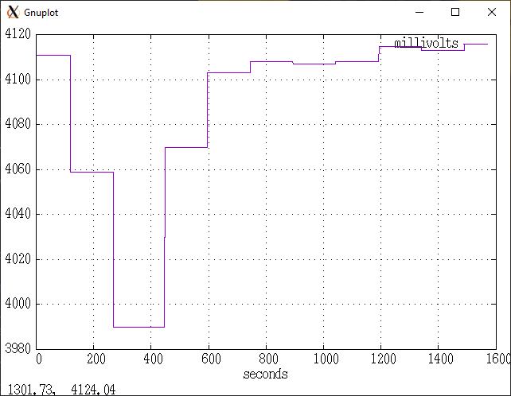

# readbatt

Tools to read and display live battery voltage and charging current with [gnuplot](http://www.gnuplot.info/)

Requirements:
- adb
- gnuplot
- [feedgnuplot](https://github.com/dkogan/feedgnuplot)

This tool was developed/tested under Cygwin. Should work equally under GNU/Linux
