# DPC Latency fix

This posts will detail the endeavour of fixing popping/cracking audio on Windows 10.

We'll go through Interrupts, DPC tasks, windows debugging and cursed setups.

Let's start with a description of the scenario:

I regularly hold calls with friends, and play playlists with them while coding.\
This involves using VB-Audio and a chat room where I can share high fidelity audio, like [edumeet](https://github.com/edumeet/edumeet).

The VB-Audio setup allows me to pipe audio through a virtual soundcard, called "CABLE Input", and have the audio available from the virtual microphone "CABLE Output".\
By then enabling monitoring/loopback (called "Listen" in Windows), I can listen to what I'm broadcasting (or record it).\
This way, I can configure e.g. Firefox to use the virtual soundcard instead of the default one, and still be able to hear stuff from it even when I'm not streaming.

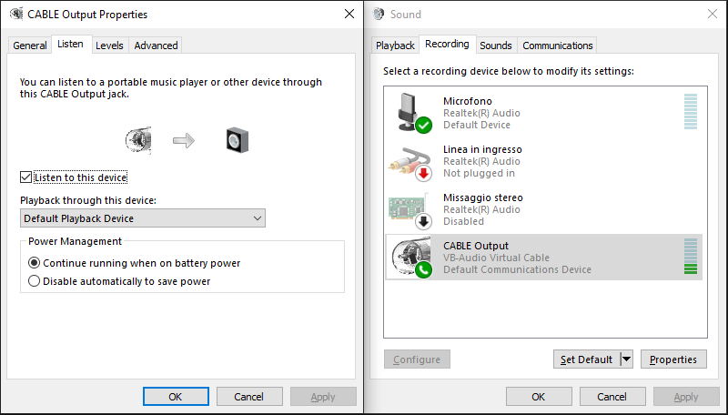

The problem is that my peers have always lamented delays, pops and cracks whenever I do intensive tasks (such as compiling C/C++ code or building large .NET projects).\
In the past months I've also started to hear those glitches myself, although they are much less pronounced than what the other party hears.

Before going in detail, let's go over the cursed setup I'm running:

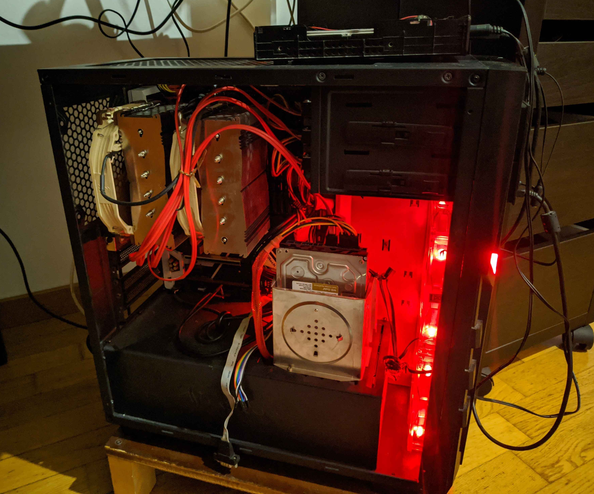

- Z270, Intel Core i7-7700k (Kaby Lake). No dedicated GPU (only the integrated Intel HD 630)

- 80GB RAM, thanks to a [custom BIOS mod](https://winraid.level1techs.com/t/guide-how-to-make-z370-chipset-mbs-compatible-with-128gb-ram/33716/50?u=smx129) (which involves disabling the Intel ~~Malware~~ Management engine)

- 4x JBOD with 8TB WD Gold disks, through a IBM ServeRaid M5110, aka an LSI SAS2208 card, which I got second hand

  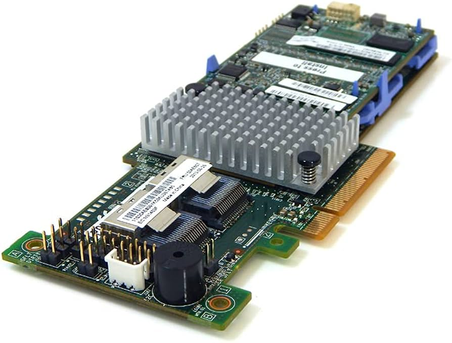


- ZFS through VMWare Workstation and Raw Disk passsthrough mode, yeah... (I could write another blog post about this, but basically I couldn't use HyperV with DDA because I need USB passthrough, and I cannot virtualize Windows under Linux/KVM until I can get a new desktop build with better hardware)

- [TrueNAS SCALE](https://www.truenas.com/truenas-scale/) (in a VM), which exposes an SMB share (for virtual machines and documents), but it's way too slow to use for building projects.\
  I then tried NFS on Windows with [interesting](https://github.com/dotnet/sdk/issues/13808#issuecomment-1821944444) [results ](https://github.com/dotnet/runtime/issues/95096)(basically, I discovered a long-standing bug in .NET Core dating back to the very first versions). Therefore the last hope was making a ZVOL and exposing it through iSCSI.

So let me get this straight:

A file operation on the `P:\` volume (over iSCSI) involves the following:

- a call to `ntfs.sys` to, say, write a file
- handled by `msiscsi.sys` which uses `storport.sys` and `tcpip.sys` to send the I/O request to the server
- a VM transition to the TrueNAS virtual machine
- going through the iSCSI daemon -&gt; Linux kernel -&gt; ZFS
- transitioning back to Windows once it's time to touch the disks
- which finally operates on the 4 disks using `megasas2.sys` and `storport.sys`


\
One would (rightfully) think this setup is broken and begging to have lag/latency, but I decided to pull ahead anyways and debug it.

Going in order, this is what I tried:

- Raising the priority of Firefox to "Above Normal" or "High"\
  This does alleviates stuttering when there's CPU contention, but doesn't sadly fix the audio glitches.
- Trying different virtual soundcards\
  I tried with [Virtual Audio Cable](https://vac.muzychenko.net) and [AudioMirror](https://github.com/JannesP/AudioMirror) as replacements, but they didn't show any improvement and actually seemed worse, delay-wise.
- Changing the Windows timer frequency\
  [TimerTool](https://github.com/tebjan/TimerTool) can change the resolution of the Windows system timer. Sadly, the value reported was already the smallest (0.5ms), so there was no room for improvement
- Changing interrupt settings\
  I then came across this [very insightful post](https://forums.guru3d.com/threads/windows-line-based-vs-message-signaled-based-interrupts-msi-tool.378044/), which explains the difference between Line-Based interrupts and Message Signaled interrupts (MSI), and how to change between them

Browsing around, I also found mention of [LatencyMon](https://www.resplendence.com/latencymon) and how it can be used to measure the system latency.

So I went ahead, got myself LatencyMon, and this was the (quite bad) situation:

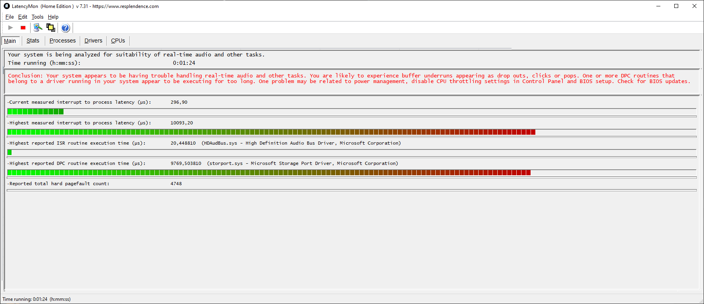

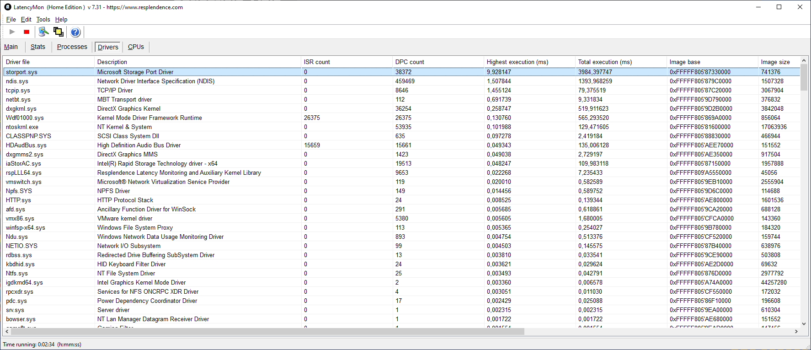

Up to 10 milliseconds of delay! no wonder the audio is sucking.

At this point, seeing `storport` as the suspect, the question was: is it the iSCSI volume or the SAS card at fault?

I first tried to play around with drivers, particularly the SAS card one (thinking it was the culprit. Spoiler alert: it wasn't).\
I read about the [Overview and lifecycle of a storport driver](https://learn.microsoft.com/en-us/windows-hardware/drivers/storage/storport-driver-overview) to get a better picture of what was going on.\
I also documented myself on [storport driver violations](https://learn.microsoft.com/en-us/windows-hardware/drivers/devtest/dv-storport-verification) that are normally caught by the driver verifier.

"Maybe the driver has useless sleep calls inside?" I wondered

Well there is an API called [StorPortStallExecution](https://learn.microsoft.com/en-us/windows-hardware/drivers/ddi/storport/nf-storport-storportstallexecution) that could cause this, but static analysis of `megasas2` (and `megasas2i`, with PDB symbols) didn't reveal any inappropriate use.\
All the driver was essentially doing is setting up the SAS card to pass on execution to `storport`. The only instances of sleep were in the card reset and firmware reload routines.\
\
So this was a dead end.

At this point I checked out MSITool, finding the following situation:

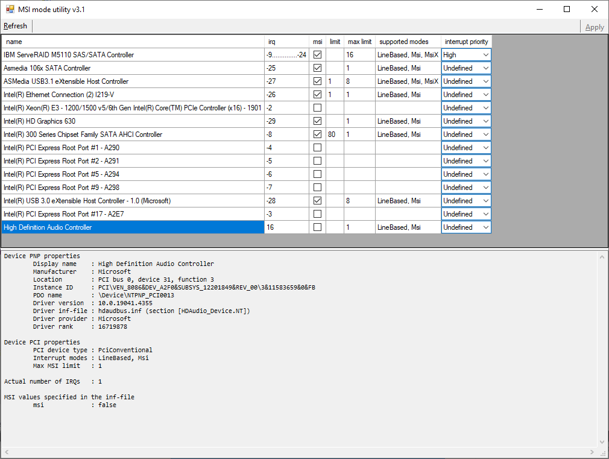

As it can be seen, my SAS card had been put in "High priority" (it's a driver default), and the internal sound card was not using MSI mode for the interrupt

What I did next, without luck was:

| Action                                  | Outcome                                                                                                                     |
| --------------------------------------- | --------------------------------------------------------------------------------------------------------------------------- |
| Set the HDA interrupt mode to MSI       | Audio now loops under load, instead of cracking/popping. It sound like a broken vinyl record jumping back to the same place |
| Increase HDA interrupt priority to high | No audible change                                                                                                           |
| Decrease SAS priority to Undefined      | No audible change                                                                                                           |

At this point I noticed people [citing](https://www.sysnative.com/forums/threads/how-to-diagnose-and-fix-high-dpc-latency-issues-with-wpa-windows-vista-7-8.5721/) `xperf` and in general the [Windows Performance Toolkit](https://learn.microsoft.com/en-us/windows-hardware/test/wpt/) which seemed like the last hope before giving up.

`xperf` basically provided the same information as Latency Monitor, so I won't go in details.\
I therefore turned into Windows Performance Toolkit.

**NOTE**: Make sure you're using the latest version of the `ADK Windows Performance Toolkit`, and that you have it in PATH before `C:\Windows\system32`

In my case, there was a much older copy of `wpr` in System32, and it was causing the issue outlined [here](https://devblogs.microsoft.com/performance-diagnostics/wpr-start-and-stop-commands/) near the bottom of the page


It was additionally also performing badly, freezing the PC up constantly.\
It took me a bit of headache before finding this, so make 100% sure you're using the latest ADK version from [here](https://learn.microsoft.com/en-us/windows-hardware/get-started/adk-install)

Another NOTE: if you start a wpr session with version X of wpr, and then try to stop it with version Y, it will fail and report a cryptic error. Make sure you have no running wpr sessions (can be checked with `wpr -status`) before starting a new one.

Once installed, I made the following batch file to start and stop the logging session

```bat
if "%1"=="start" (
	wpr -start GeneralProfile -start CPU -start Audio -start DiskIO -recordtempto S:\
	wpr -status
) else (
	wpr -stop S:\test.etl
)
```

Drive `S:\` is a ramdisk I created with [IMDisk Toolkit](https://sourceforge.net/projects/imdisk-toolkit/) to speedup saving and loading of the trace file

So I started a session, triggered the audio glitches by compiling something, and stopped the session.\
After loading the resulting ETL file with WPA (Windows Performance Analyzer), you'll need to select `Trace -> Load Symbols` in order to have meaningful results in the trace view.

HOWEVER, before you do this, make sure your drive has enough space for the massive amount of PDB files that will be downloaded.\
WPA will try to download PDB files for each and every loaded driver and running application referenced by the trace.\
Since I was compiling a C# program in Visual Studio, this amounted to over 3000 PDB files and a whopping 5.65GB of disk space.

A good idea is to set the environment variables \_`NTSYMBOL_PATH` and \_`NTSYMCACHE_PATH `to point to a location that has enough space. It can also be changed within the symbol load options in WPA

This was the situation after the first sample. The high majority of time is spent in `ntoskrnl`, as indicated by those big red spikes.\
This was confusing at first, since it wasn't showing `msiscsi` nor `megasas2`, as I was hoping to see (it would have concluded that the miniport driver is at fault)

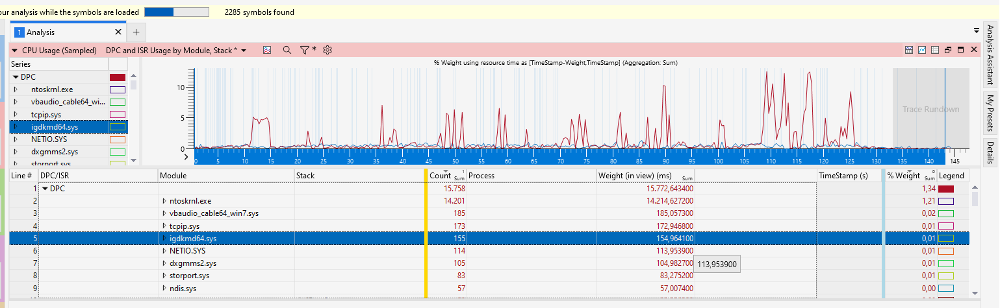

If we go in details, isolating 1s of trace (clicking on the graph), we then see (note: this is a different trace capture than in the previous screenshot)

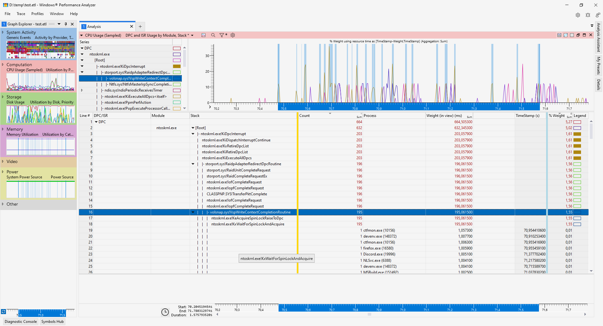

This highlights a Spinlock taking a considerable amount of time.\
Spinlocks are bad for timing because they stall the CPU waiting for a separate core, but they are the only available synchronization primitive available in DPCs since they run at `DISPATCH_LEVEL`\
Another problem is that, once a DPC is scheduled to run, it has to complete. It cannot be paused and executed later.\
DPCs that run for too long will trigger an internal kernel watchdog, resulting in a `DPC WATCHDOG VIOLATION` BSOD.

If a DPC needs to perform long running operations, it should use `Work Items` instead (via **IoQueueWorkItem**). An added bonus of Work Items is that they run at `PASSIVE_LEVEL` and thus can issue blocking calls/mutexes.\
Any driver taking too much time in DPC calls is basically a bad/rogue driver and should be corrected.

At that time I was a bit tired and didn't notice `volsnap` right away. I instead went to look at CLASSPNP, which has actually been [open sourced](https://github.com/microsoft/Windows-driver-samples/tree/main/storage/class/classpnp) by Microsoft! \
I also looked into `storport.sys` itself, finding an interesting switch that is documented in the [Performance Tuning Guidelines for Windows Server 2012 R2](https://download.microsoft.com/download/9/b/2/9b205446-37ee-4bb1-9a50-e872565692f1/perftuningguideserver2012r2.pdf): `DpcCompletionLimit`

Essentially, Storport works by grouping together I/O requests (128 by default), and awaiting for their completion at the same time in a DPC routine.\
For slow I/O devices, this can drastically increase the time needed to complete the DPC routine.

By creating a `REG_DWORD` in `HKLM\System\CurrentControlSet\Control\Storport\DpcCompletionLimit`, one can control the chunking size for Storport, or disable it by setting it to 1.\
If you set a value of 0, the code will set it to -1, aka `ULONG_MAX`, effectively making the DPC wait for ALL outstanding I/O requests before returning.

NOTE: setting the value to 0 or a large value puts you at risk of getting a `DPC WATCHDOG VIOLATION`

In my case, I tried halving it to 64, then 32, and ultimately 1.\
I was expecting to see a latency gain by reducing the value, at the expense of throughput, but the gains were either minimal/within the margin of error, or not significant.\
\
So I went back to the trace and.... hold on a second, what is `volsnap` doing in there?\
A quick google search reveals that `volsnap` is associated with Volume Shadow Service, Volume Shadow Copies and System Restore Points.

What is it doing on my projects drive then? Well, it could be used for the `Previous Versions` feature, but I don't remember ever enabling it or using it.\
Indeed, "there are no previous versions available"

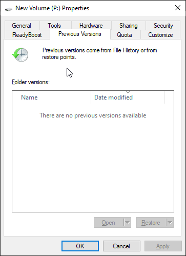

So what's going on?\
The way to check for it is _very obvious and straightforward_ (sarcasm)\
First, you need to go to "System Protection" in `Control Panel` -&gt; `System`

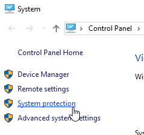

Then under `System Protection`

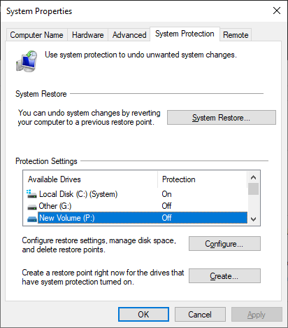

And here we can see drives... but "Protection" is `Off` on the iSCSI volume.\
Does it mean that VSS is inactive for the drive? **NO!**\
You have to click `Configure`, regardless of the protection status, to see the VSS status.\
I already wiped the data for the volume as I'm writing this, but consider this as the situation I had:

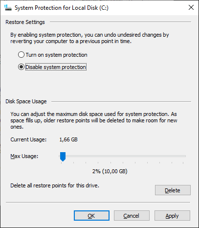

System restore points are disabled, but there's still previous data stored in the drive. This will cause VSS to be active! even if System Restore points are unused.\
A good tool to view this data is [ShadowExplorer](https://www.shadowexplorer.com/downloads.html), which helped me find out what that was and helped me figure out what put it there.

Turns out it was created by the windows backup/imaging tool when I took a snapshot of `C:\` in an evening of December 2023:

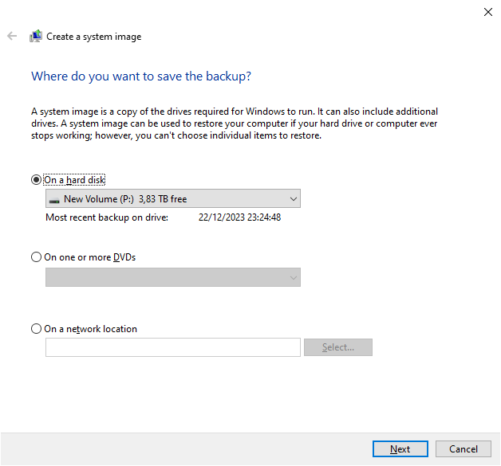

Since I didn't need a snapshot of the volume at that timei clicked `Delete` and... [SystemInformer](https://systeminformer.sourceforge.io/) (which I had open and watches for service modifications) notified me that a VSS service was modified/removed.\
So I go back to Visual Studio to rebuild the project, fingers crossed.... and BINGO. problem solved!

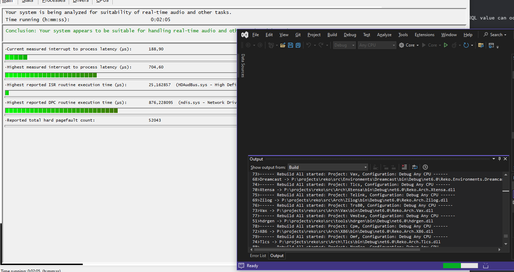

Conclusion:\
Turns out that `volsnap` acts a write filter for the drive, and it gets enabled whenever there are Shadow Copies on the volume.\
**It doesn't matter if System Restore Points are enabled or not for the drive**. As long as there is any shadow copy, the filter will be active.\
A quick look at the call chain of `volsnap` reveals the following flow:

- `VolSnapWrite`
- `VolsnapWriteFilter`
- `VspWriteContextCompletionRoutine`

`VolSnapWrite` is registered in `DriverEntry` by the folllowing code:

```c
  DriverObject->MajorFunction[IRP_MJ_READ] = (PDRIVER_DISPATCH)VolSnapRead;
  DriverObject->MajorFunction[IRP_MJ_WRITE] = (PDRIVER_DISPATCH)VolSnapWrite;
```

This therefore confirms that a volume having Shadow Copies will cause `volsnap` to be loaded for that volume, causing CONSIDERABLE slowdowns in read/write operations (but mostly writes, from what I could tell).

For whoever got this far and is having issues with `storport.sys` and DPC latency, it might very well be caused by VSS and its dubious practices (using Spinlocks in DPC context)